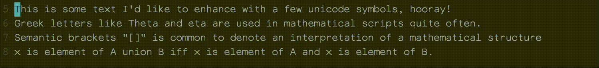

# abbrev-expand.nvim

## Preview



## Setup

Setup used in the demo (press `<C-]>` at the end of an abbreviation in insert mode and anywhere in visual mode to expand):

```lua
require('abbrev-expand').setup {
  map = {
    {"hooray", "🥳"},
    {"eta", "η"},
    {"Theta", "theta"},
    {"[", ""},
    {"]", ""},
    {"union", "∪"},
    {"iff", "⇔"},
    {"and", "∧"},
    {"elem", "∈"}
 }
}

vim.api.nvim_set_keymap('i', '<C-]>', '<Left><C-o>:lua require("abbrev-expand").expand(".")<CR><Right>',
                        {noremap = true, silent = true})
vim.api.nvim_set_keymap('x', '<C-]>', ':lua require("abbrev-expand").expand("\'>")<CR>',
                        {noremap = true, silent = true})

```
